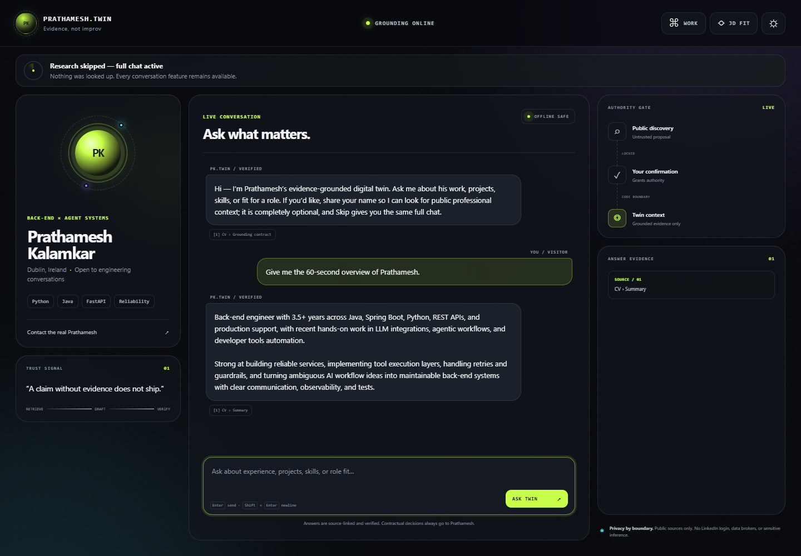
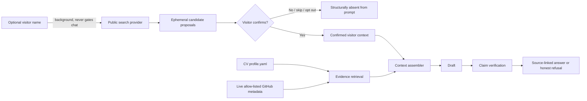

# digital-twin

> Research can propose chat context. Only the visitor can grant that context authority.

This is Prathamesh Kalamkar's recruiter-facing AI twin: a polished chat experience that
answers from his CV and live metadata for ten allow-listed GitHub repositories. Its central
engineering decision is an **authority gate**, not a clever prompt. A background search can
find possible visitor profiles, but the context assembler has no code path that can include a
candidate until the visitor explicitly confirms it. Outreach is a separate, auditable effect
boundary with an owner-configured count policy, suppression/caps, and delivery preflight.

That is the same correctness pattern explored in
[`effect-broker`](https://github.com/prathamesh-git9/effect-broker) and
[`agent-runtime`](https://github.com/prathamesh-git9/agent-runtime): a proposal is not an
authorised effect. Tests assert the boundary directly.



## What carries weight

- Source-grounded chat over the exact structured CV corpus in [`data/profile.yaml`](data/profile.yaml)
  and live GitHub metadata. Every factual answer names its sources.
- A second verification pass checks every drafted claim against its cited evidence, including
  numeric claims. Unsupported claims are removed; an empty answer becomes an honest refusal.
- Optional-name onboarding with a real Skip path. Research runs in the background and never
  gates chat.
- Live SSE research progress, attributed person/company dossiers, rich identity cards, public
  profile links, photo/Gravatar/initials fallback, and immediate stop-and-purge.
- Pluggable public-search providers: DuckDuckGo HTML (no key), Tavily, Serper, and Brave.
  Research never authenticates to LinkedIn and only uses observed public links.
- Public ATS discovery for Greenhouse, Lever, Ashby, Workable, SmartRecruiters, and Recruitee,
  with explainable role ranking and a careers-page fallback that never invents a requisition.
- Published/pattern email discovery with honest `verified`/`inferred` labels, MX validation,
  no SMTP mailbox probes, short referral-aware variants, a signed exact-body approval flow,
  and count-based owner fanout with uncertainty-safe copy.
- Deterministic JD-fit analysis that distinguishes “directly evidenced” from “not evidenced in
  this CV.” It never silently upgrades a gap into a match.
- Live GitHub stats, topics, and three recent commits for `effect-broker`, `agent-runtime`,
  `effect-browser`, `agent-redteam`, `answer-engine`, `agent-mesh`, `llm-gateway`,
  `promise-ledger`, `reachable`, and `trustdesk`.
- Layered prompt-injection defence for visitor text, pasted job descriptions, repository
  metadata, and poisoned search results.
- An authenticated owner dashboard, CRM/replay, outreach audit and variant counts, and CSV
  export. Raw IP addresses remain deliberately unavailable.
- Per-IP/session sliding-window limits, a hard per-session token budget, maximum input sizes,
  safe external URLs, security headers, and an offline scripted provider.
- A dependency-free, responsive interface with dark/light themes and a one-tag floating widget.
- The agent's tool loop is visible as it runs: each `tool.call`/`tool.result` frame paints a
  step with its status, duration and source hosts, and the finished trace stays folded under
  the answer it produced. Every answer states whether it is grounded, refused for lack of
  evidence, or declined as outside what the twin may decide.
- Visitor-side session control: the conversation survives a reload, and one button purges the
  session server-side and drops the browser's copy of the transcript.


The candidate screenshot uses synthetic names and domains. A real public-provider probe was
purged after the run so the repository does not retain research about an unconfirmed person.

## The boundary, in one diagram



The important part is the `No` branch: pre-confirmation isolation happens while assembling the
context, before any model is called. Prompt instructions are defence in depth, not the access
control mechanism.

## Run locally

Python 3.11 or newer is required.

```bash
python -m venv .venv
# Windows: .venv\Scripts\activate
# macOS/Linux: source .venv/bin/activate
pip install -e ".[dev]"
uvicorn digital_twin.main:app --reload
```

Open <http://localhost:8000>. The default `scripted` provider needs no network, model key, or
search key for chat. DuckDuckGo research and the live GitHub panel use public network access and
degrade quietly when unavailable.

Run the checks:

```bash
ruff format --check .
ruff check .
pytest
```

## Model provider

The production adapter speaks the standard Chat Completions shape and takes only `base_url`,
`api_key`, and `model`, so DeepSeek, Zhipu GLM, Moonshot Kimi, Alibaba Qwen, Groq, Together, and
OpenRouter can be selected by configuration rather than application code.

The same adapter was exercised end to end against xAI Grok 4.5 using the official
[`https://api.x.ai/v1` Chat Completions endpoint](https://docs.x.ai/developers/model-capabilities/legacy/chat-completions):

```dotenv
TWIN_PROVIDER=openai-compatible
TWIN_LLM_BASE_URL=https://api.x.ai/v1
TWIN_LLM_API_KEY=replace-me
TWIN_LLM_MODEL=grok-4.5
```

The live draft was still passed through the application-owned claim verifier; selecting a
stronger provider never bypasses the evidence boundary. See the
[Grok-backed UI capture](artifacts/grok-live.png) and the redacted
[end-to-end report](artifacts/e2e-report.json).

Offline scripted mode is the default because a recruiter demo and CI must remain usable with no
secret. The documented cheap production default is currently DeepSeek V4 Flash:

```dotenv
TWIN_PROVIDER=openai-compatible
TWIN_LLM_BASE_URL=https://api.deepseek.com
TWIN_LLM_API_KEY=replace-me
TWIN_LLM_MODEL=deepseek-v4-flash
```

As checked on 2 August 2026, the official
[DeepSeek pricing page](https://api-docs.deepseek.com/quick_start/pricing/) lists V4 Flash at
$0.14 per million cache-miss input tokens, $0.0028 per million cache-hit input tokens, and $0.28
per million output tokens. It is a sensible low-cost default, not a permanent endorsement:
pricing, availability, data-processing terms, latency, and model behaviour can change. Re-check
those constraints before deployment. The hard application token budget remains active for every
compatible provider.

## Research providers

`TWIN_SEARCH_PROVIDER` accepts `duckduckgo`, `tavily`, `serper`, or `brave`. The three keyed
providers use `TWIN_SEARCH_API_KEY`; selecting one without a key safely falls back to
DuckDuckGo.

The retrieval stack is deliberately compositional: Scrapling provides the async network edge,
Trafilatura extracts main article text, Selectolax extracts metadata/links, and the standard
robots parser enforces `robots.txt` before page fetch. `tldextract` uses its bundled public
suffix snapshot without a runtime list download, `email-validator` handles syntax, and
dnspython handles async MX/TXT checks. HN Algolia, public GitHub organisation activity, and
RSS/Atom are optional sources. Every source has an independent timeout and can fail without
disrupting chat.

Confidence is deterministic:

| Observable signal | Maximum contribution |
|---|---:|
| Name-token coverage in the result title | 55 |
| Stated employer overlap | 20 |
| Stated location overlap | 10 |
| Search rank | 10 |
| Source authority/domain overlap | 10 |

Scores are capped at 100 and each result exposes the contributing reasons. The score is a match
aid, never an identity claim. Search snippets containing prompt-injection patterns or sensitive
categories are discarded. Candidate/dossier payloads remain in process memory. Mutable outreach
drafts may be persisted before selection by the owner policy; opt-out/session end removes those
drafts and research, while an already attempted effect keeps its minimal append-only audit row.

## Embeddable widget

Add one script tag to any page:

```html
<script
  src="https://your-twin.example/widget.js"
  data-label="ASK PRATHAMESH"
  data-position="right"
  data-color="#c8ff48"
></script>
```

The script creates an accessible floating launcher and an isolated iframe backed by the same
standalone app. `data-twin-url` can override the origin when the script is served through a CDN.

## Owner dashboard

The dashboard is disabled—not publicly exposed with a default password—until both values are
configured:

```dotenv
TWIN_OWNER_USERNAME=owner
TWIN_OWNER_PASSWORD=a-long-random-password
```

Then open `/owner` and use HTTP Basic authentication. The dashboard shows sessions, questions,
explicitly confirmed candidates, message counts, and approximate token usage, with a CSV export.
It never exposes raw IPs. The authenticated CRM/replay endpoints expose research and outreach
needed for owner review.

## Outreach, Gmail, and owner notifications

With `TWIN_FANOUT_UNSELECTED=true`, one to `TWIN_FANOUT_MAX` candidates are eligible for
unattended outreach. A sole high-confidence match can use confident copy; every ambiguous
candidate receives a distinct template that says they *may* have looked at the profile and can
ignore it if not. A larger candidate set stays in review. This policy never bypasses suppression,
once-only keys, `TWIN_DAILY_SEND_CAP`, or sender-domain SPF/DKIM/DMARC preflight.

Real delivery additionally requires `TWIN_AUTOSEND=true` and Gmail credentials for
`smtp.gmail.com:587` with STARTTLS. Test connectivity without sending a message:

```bash
digital-twin-smtp-check
```

Pushover notifications are background-only and rate-limited. With
`TWIN_PUSHOVER_ENABLED=true`, short notices cover session/research activity, delivery decisions,
LinkedIn actions, and errors. Notification failure never blocks chat.

## LinkedIn automation warning

Install the optional extra with `pip install -e ".[linkedin]"` and use only the owner’s own
logged-in LinkedIn profile. The persistent browser data directory is local and gitignored; the
application never accepts cookies or passwords. Actions are visible (no stealth), human-paced,
capped, once-only, and individually approved unless `TWIN_LINKEDIN_AUTO=true`. Any account
challenge stops for human handoff. There is no CAPTCHA bypass, proxy rotation, or alternate-user
automation.

LinkedIn can change its UI or restrict accounts for automation. The owner must review LinkedIn’s
current terms and accept that account risk before enabling it. Keep
`TWIN_LINKEDIN_KILL_SWITCH=true` whenever automation should stop immediately.

## Configuration

See [`.env.example`](.env.example) for the full set. Notable controls are:

| Variable | Default | Purpose |
|---|---|---|
| `TWIN_PROVIDER` | `scripted` | Offline or OpenAI-compatible drafting |
| `TWIN_SEARCH_PROVIDER` | `duckduckgo` | Public search adapter |
| `TWIN_TOKEN_BUDGET_PER_SESSION` | `12000` | Hard hostile-session spend cap |
| `TWIN_REQUESTS_PER_MINUTE` | `30` | Per-IP/session sliding limit |
| `TWIN_SHOW_PHONE` | `false` | Phone publication privacy gate |
| `TWIN_DATABASE_URL` | `sqlite:///./digital-twin.db` | SQLAlchemy 2 database URL |
| `TWIN_HASH_SECRET` | development placeholder | HMAC key for non-reversible IP hashes |
| `TWIN_AUTOSEND` | `false` | Enables real Gmail delivery after every policy/safety check |
| `TWIN_FANOUT_UNSELECTED` | `false` | Enables the owner’s count-based unattended candidate flow |
| `TWIN_FANOUT_MAX` | `3` | Maximum candidate set eligible for unattended fanout |
| `TWIN_DAILY_SEND_CAP` | `20` | Hard global email cap checked before every send |
| `TWIN_LINKEDIN_AUTO` | `false` | Allows unattended owner-profile actions; manual approval is default |
| `TWIN_PUSHOVER_ENABLED` | `false` | Enables non-blocking owner activity notices |

Use a strong `TWIN_HASH_SECRET`, HTTPS, a managed database/backup policy, and an explicit data
retention policy in production. SQLite is intentionally the deployable single-instance default.
SSE state and unconfirmed candidate caches are process-local; multi-instance deployment needs a
shared ephemeral broker while preserving the same authority check.

## API surface

The complete request/response and SSE contract is in [`docs/API.md`](docs/API.md). Interactive
OpenAPI documentation is at `/docs`.

## Evidence and end-to-end proof

- [End-to-end transcript](artifacts/e2e-transcript.md)
- [Machine-readable verification report](artifacts/e2e-report.json)
- [Chat flow screenshot](artifacts/chat-flow.png)
- [Research/authority-gate screenshot](artifacts/research-flow.png)

The test suite runs without network access or API keys. It covers the context authority gate,
rich field attribution/no invented profiles, robots/timeouts, email confidence and MX, ATS
detection/ranking, safe referral/fanout copy, exact-body tokens, DNS refusal, global/once-only
caps, LinkedIn approval/challenge/caps, mocked Pushover, injection/grounding, rate/token limits,
dashboard authentication, and session purge.

## Deployment

The multi-stage Dockerfile builds a compact image and runs as an unprivileged user:

```bash
docker build -t digital-twin .
docker run --rm -p 8000:8000 --env-file .env digital-twin
```

GitHub Actions tests Python 3.11, 3.12, and 3.13 with network explicitly blocked inside pytest.

## License

[MIT](LICENSE) © 2026 Prathamesh Kalamkar.
