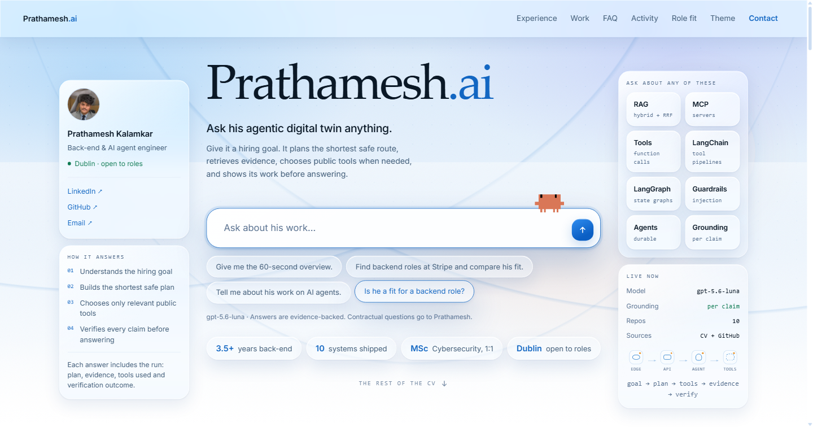
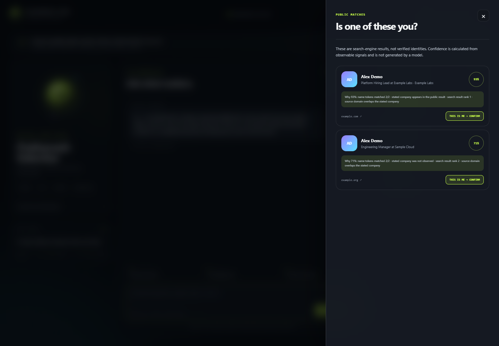
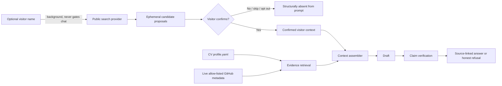

# Prathamesh.ai — Agentic Digital Twin

> Research can propose chat context. Only the visitor can grant that context authority.

This is Prathamesh Kalamkar's recruiter-facing **agentic digital twin**: a bounded agent that
turns a hiring goal into a plan, chooses relevant public tools, retrieves evidence from his CV
and ten allow-listed GitHub repositories, and verifies every claim before answering. Its central
engineering decision is an **authority gate**, not a clever prompt. A background search can
find possible visitor profiles, but the context assembler has no code path that can include a
candidate until the visitor explicitly confirms it. Outreach is a separate, auditable effect
boundary with an owner-configured count policy, suppression/caps, and delivery preflight.

That is the same correctness pattern explored in
[`effect-broker`](https://github.com/prathamesh-git9/effect-broker) and
[`agent-runtime`](https://github.com/prathamesh-git9/agent-runtime): a proposal is not an
authorised effect. Tests assert the boundary directly.



## What carries weight

- Source-grounded chat over the exact structured CV corpus in [`data/profile.yaml`](data/profile.yaml)
  and live GitHub metadata. Every factual answer names its sources.
- BM25 evidence ranking with an auditable recruiter-vocabulary alias map, measured against a
  golden question set: recall@8 went from 12/24 to 24/24, removing false refusals about
  qualifications the CV plainly contains. See [Retrieval quality](#retrieval-quality).
- A second verification pass checks every drafted claim against its cited evidence, including
  numeric claims and any name the claim introduces. Unsupported claims are removed; an empty
  answer becomes an honest refusal. Measured on a labelled set: precision 0.556 to 0.941 once
  added-content fabrications were caught. See [Claim verification](#claim-verification).
- Optional-name onboarding with a real Skip path. Research runs in the background and never
  gates chat.
- Live SSE research progress, attributed person/company dossiers, rich identity cards, public
  profile links, photo/Gravatar/initials fallback, and immediate stop-and-purge.
- Pluggable public-search providers: DuckDuckGo HTML (no key), Tavily, Serper, and Brave.
  Research never authenticates to LinkedIn and only uses observed public links.
- Public ATS discovery for Greenhouse, Lever, Ashby, Workable, SmartRecruiters, and Recruitee,
  with explainable role ranking and a careers-page fallback that never invents a requisition.
- Published/pattern email discovery with honest `verified`/`inferred` labels, MX validation,
  no SMTP mailbox probes, short referral-aware variants, a signed exact-body approval flow,
  and count-based owner fanout with uncertainty-safe copy.
- Deterministic JD-fit analysis that distinguishes “directly evidenced” from “not evidenced in
  this CV.” It never silently upgrades a gap into a match.
- Live GitHub stats, topics, and three recent commits for `effect-broker`, `agent-runtime`,
  `effect-browser`, `agent-redteam`, `answer-engine`, `agent-mesh`, `llm-gateway`,
  `promise-ledger`, `reachable`, and `trustdesk`.
- Layered prompt-injection defence for visitor text, pasted job descriptions, repository
  metadata, and poisoned search results — where the load-bearing layer is grounding, not
  pattern matching. See [What the injection filter is worth](#what-the-injection-filter-is-worth).
- An authenticated owner dashboard, CRM/replay, outreach audit and variant counts, and CSV
  export. Raw IP addresses remain deliberately unavailable.
- Per-IP/session sliding-window limits, a hard per-session token budget, maximum input sizes,
  safe external URLs, security headers, and an offline scripted provider.
- A dependency-free, responsive interface with dark/light themes and a one-tag floating widget.
- The agent's tool loop is visible as it runs: each `tool.call`/`tool.result` frame paints a
  step with its status, duration and source hosts, and the finished trace stays folded under
  the answer it produced. Every answer states whether it is grounded, refused for lack of
  evidence, or declined as outside what the twin may decide.
- Each question is routed through an explicit bounded plan. The planner narrows the available
  tools by intent, streams retrieval/tool/verification phases over SSE, and returns a structured
  `agent_run` so the interface can show what the system actually did rather than merely call
  itself agentic.
- Visitor-side session control: the conversation survives a reload, and one button purges the
  session server-side and drops the browser's copy of the transcript.



The candidate screenshot uses synthetic names and domains. A real public-provider probe was
purged after the run so the repository does not retain research about an unconfirmed person.

## The boundary, in one diagram



The important part is the `No` branch: pre-confirmation isolation happens while assembling the
context, before any model is called. Prompt instructions are defence in depth, not the access
control mechanism.

## Run locally

Python 3.11 or newer is required.

```bash
python -m venv .venv
# Windows: .venv\Scripts\activate
# macOS/Linux: source .venv/bin/activate
pip install -e ".[dev]"
uvicorn agentic_digital_twin.main:app --reload
```

Open <http://localhost:8000>. The default `scripted` provider needs no network, model key, or
search key for chat. DuckDuckGo research and the live GitHub panel use public network access and
degrade quietly when unavailable.

Run the checks:

```bash
ruff format --check .
ruff check .
pytest
```

## Model provider

The production adapter speaks the standard Chat Completions shape and takes only `base_url`,
`api_key`, and `model`, so DeepSeek, Zhipu GLM, Moonshot Kimi, Alibaba Qwen, Groq, Together, and
OpenRouter can be selected by configuration rather than application code.

The same adapter was exercised end to end against xAI Grok 4.5 using the official
[`https://api.x.ai/v1` Chat Completions endpoint](https://docs.x.ai/developers/model-capabilities/legacy/chat-completions):

```dotenv
TWIN_PROVIDER=openai-compatible
TWIN_LLM_BASE_URL=https://api.x.ai/v1
TWIN_LLM_API_KEY=replace-me
TWIN_LLM_MODEL=grok-4.5
```

The live draft was still passed through the application-owned claim verifier; selecting a
stronger provider never bypasses the evidence boundary. See the
[Grok-backed UI capture](artifacts/grok-live.png) and the redacted
[end-to-end report](artifacts/e2e-report.json).

Offline scripted mode is the default because a recruiter demo and CI must remain usable with no
secret. The documented cheap production default is currently DeepSeek V4 Flash:

```dotenv
TWIN_PROVIDER=openai-compatible
TWIN_LLM_BASE_URL=https://api.deepseek.com
TWIN_LLM_API_KEY=replace-me
TWIN_LLM_MODEL=deepseek-v4-flash
```

As checked on 2 August 2026, the official
[DeepSeek pricing page](https://api-docs.deepseek.com/quick_start/pricing/) lists V4 Flash at
$0.14 per million cache-miss input tokens, $0.0028 per million cache-hit input tokens, and $0.28
per million output tokens. It is a sensible low-cost default, not a permanent endorsement:
pricing, availability, data-processing terms, latency, and model behaviour can change. Re-check
those constraints before deployment. The hard application token budget remains active for every
compatible provider.

## Research providers

`TWIN_SEARCH_PROVIDER` accepts `duckduckgo`, `tavily`, `serper`, or `brave`. The three keyed
providers use `TWIN_SEARCH_API_KEY`; selecting one without a key safely falls back to
DuckDuckGo.

The retrieval stack is deliberately compositional: Scrapling provides the async network edge,
Trafilatura extracts main article text, Selectolax extracts metadata/links, and the standard
robots parser enforces `robots.txt` before page fetch. `tldextract` uses its bundled public
suffix snapshot without a runtime list download, `email-validator` handles syntax, and
dnspython handles async MX/TXT checks. HN Algolia, public GitHub organisation activity, and
RSS/Atom are optional sources. Every source has an independent timeout and can fail without
disrupting chat.

Confidence is deterministic:

| Observable signal | Maximum contribution |
|---|---:|
| Name-token coverage in the result title | 55 |
| Stated employer overlap | 20 |
| Stated location overlap | 10 |
| Search rank | 10 |
| Source authority/domain overlap | 10 |

Scores are capped at 100 and each result exposes the contributing reasons. The score is a match
aid, never an identity claim. Search snippets containing prompt-injection patterns or sensitive
categories are discarded. Candidate/dossier payloads remain in process memory. Mutable outreach
drafts may be persisted before selection by the owner policy; opt-out/session end removes those
drafts and research, while an already attempted effect keeps its minimal append-only audit row.

## Embeddable widget

Add one script tag to any page:

```html
<script
  src="https://your-twin.example/widget.js"
  data-label="ASK PRATHAMESH"
  data-position="right"
  data-color="#c8ff48"
></script>
```

The script creates an accessible floating launcher and an isolated iframe backed by the same
standalone app. `data-twin-url` can override the origin when the script is served through a CDN.

## Owner dashboard

The dashboard is disabled—not publicly exposed with a default password—until both values are
configured:

```dotenv
TWIN_OWNER_USERNAME=owner
TWIN_OWNER_PASSWORD=a-long-random-password
```

Then open `/owner` and use HTTP Basic authentication. The dashboard shows sessions, questions,
explicitly confirmed candidates, message counts, and approximate token usage, with a CSV export.
It never exposes raw IPs. The authenticated CRM/replay endpoints expose research and outreach
needed for owner review.

## Outreach, Gmail, and owner notifications

With `TWIN_FANOUT_UNSELECTED=true`, one to `TWIN_FANOUT_MAX` candidates are eligible for
unattended outreach. A sole high-confidence match can use confident copy; every ambiguous
candidate receives a distinct template that says they *may* have looked at the profile and can
ignore it if not. A larger candidate set stays in review. This policy never bypasses suppression,
once-only keys, `TWIN_DAILY_SEND_CAP`, or sender-domain SPF/DKIM/DMARC preflight.

Real delivery additionally requires `TWIN_AUTOSEND=true` and Gmail credentials for
`smtp.gmail.com:587` with STARTTLS. Test connectivity without sending a message:

```bash
agentic-digital-twin-smtp-check
```

Pushover notifications are background-only and rate-limited. With
`TWIN_PUSHOVER_ENABLED=true`, short notices cover session/research activity, delivery decisions,
LinkedIn actions, and errors. Notification failure never blocks chat.

## LinkedIn automation warning

Install the optional extra with `pip install -e ".[linkedin]"` and use only the owner’s own
logged-in LinkedIn profile. The persistent browser data directory is local and gitignored; the
application never accepts cookies or passwords. Actions are visible (no stealth), human-paced,
capped, once-only, and individually approved unless `TWIN_LINKEDIN_AUTO=true`. Any account
challenge stops for human handoff. There is no CAPTCHA bypass, proxy rotation, or alternate-user
automation.

LinkedIn can change its UI or restrict accounts for automation. The owner must review LinkedIn’s
current terms and accept that account risk before enabling it. Keep
`TWIN_LINKEDIN_KILL_SWITCH=true` whenever automation should stop immediately.

## Configuration

See [`.env.example`](.env.example) for the full set. Notable controls are:

| Variable | Default | Purpose |
|---|---|---|
| `TWIN_PROVIDER` | `scripted` | Offline or OpenAI-compatible drafting |
| `TWIN_SEARCH_PROVIDER` | `duckduckgo` | Public search adapter |
| `TWIN_TOKEN_BUDGET_PER_SESSION` | `12000` | Hard hostile-session spend cap |
| `TWIN_REQUESTS_PER_MINUTE` | `30` | Per-IP/session sliding limit |
| `TWIN_SHOW_PHONE` | `false` | Phone publication privacy gate |
| `TWIN_DATABASE_URL` | `sqlite:///./agentic-digital-twin.db` | SQLAlchemy 2 database URL |
| `TWIN_HASH_SECRET` | development placeholder | HMAC key for non-reversible IP hashes |
| `TWIN_AUTOSEND` | `false` | Enables real Gmail delivery after every policy/safety check |
| `TWIN_FANOUT_UNSELECTED` | `false` | Enables the owner’s count-based unattended candidate flow |
| `TWIN_FANOUT_MAX` | `3` | Maximum candidate set eligible for unattended fanout |
| `TWIN_DAILY_SEND_CAP` | `20` | Hard global email cap checked before every send |
| `TWIN_LINKEDIN_AUTO` | `false` | Allows unattended owner-profile actions; manual approval is default |
| `TWIN_PUSHOVER_ENABLED` | `false` | Enables non-blocking owner activity notices |

Use a strong `TWIN_HASH_SECRET`, HTTPS, a managed database/backup policy, and an explicit data
retention policy in production. SQLite is intentionally the deployable single-instance default.
SSE state and unconfirmed candidate caches are process-local; multi-instance deployment needs a
shared ephemeral broker while preserving the same authority check.

## API surface

The complete request/response and SSE contract is in [`docs/API.md`](docs/API.md). Interactive
OpenAPI documentation is at `/docs`.

## Evidence and end-to-end proof

- [End-to-end transcript](artifacts/e2e-transcript.md)
- [Machine-readable verification report](artifacts/e2e-report.json)
- [Agentic digital twin interface](artifacts/agentic-digital-twin-linkedin.png)
- [Research/authority-gate screenshot](artifacts/research-flow.png)

The test suite runs without network access or API keys (`191 passed`). It covers the context
authority gate, rich field attribution/no invented profiles, robots/timeouts, email confidence
and MX, ATS detection/ranking, safe referral/fanout copy, exact-body tokens, DNS refusal,
global/once-only caps, LinkedIn approval/challenge/caps, mocked Pushover, injection/grounding,
retrieval recall, rate/token limits, dashboard authentication, and session purge.

## Retrieval quality

The twin refuses when nothing it retrieved supports a claim, which makes retrieval recall a
credibility property rather than a relevance nicety. A visitor who asks about a master's degree
and is told "I don't have reliable evidence for that" has been given a false negative about a
real qualification.

Ranking counted overlapping tokens, which had two problems. Every token weighed the same, so
"engineer" — in most of the CV — counted as much as "Kafka", which appears once. And recruiters
do not use CV vocabulary: someone asks about *message queues* where the CV says Kafka and SQS,
or *containers* where it says Docker. With no shared token the corpus returned nothing at all.

Ranking is now BM25, so a rare matching term outranks a common one, plus a hand-written alias
map from recruiter vocabulary onto words this CV actually uses. Measured against
[`data/retrieval_eval.yaml`](data/retrieval_eval.yaml), 24 questions whose answers were argued
from the CV itself:

| | recall@8 | MRR | questions returning no evidence |
| --- | --- | --- | --- |
| Token overlap | 12/24 (50%) | 0.368 | 1 |
| BM25 + aliases | 24/24 (100%) | 0.896 | 0 |

Two things keep this from being a way to overstate experience. The alias map is data, reviewable
in a diff, and a test asserts every expansion target is vocabulary that genuinely appears in
`profile.yaml` — an alias cannot point at a technology the CV lacks. And expansion only changes
*which evidence is retrieved*; the grounding verifier is untouched, so asking about Kubernetes
still supports no Kubernetes claim, because there is nothing to find.

**Read the 100% with the caveat it deserves.** The eval set and the alias map were written in the
same sitting, so the set measures whether known vocabulary gaps stay closed, not how the ranker
handles phrasing nobody anticipated. It is a regression gate, not evidence of general recall.

### Follow-up questions

Retrieval saw only the current message, so the second half of every real conversation searched on
words that name nothing. "Tell me about your observability work" retrieves correctly; "what did
you use there?" retrieves on *use*, and the twin answers a question nobody asked.

A follow-up — one that leans on a demonstrative, or has almost no content words left after stop
words — now carries forward terms from the visitor's **own** earlier turns. Not from the twin's
answers: an answer's vocabulary is what the model chose to say, and feeding it back would let one
loose reply steer every later retrieval. Expansion applies to retrieval only; the model still
receives the question exactly as written.

## What the injection filter is worth

`contains_prompt_injection` is a regex filter over visitor text. Measuring it produced the
most useful number in this repo, because it is the one that says *don't rely on me*:

| Corpus | Caught |
| --- | --- |
| 18 phrasings the patterns were written against | 18 / 18 |
| 10 phrasings written afterwards for the same intents | **0 / 10** |
| 26 ordinary recruiter questions | 0 false positives |

The 100% is meaningless — the patterns and that corpus were written together. The honest
figure is the second row: reword the request and the filter sees nothing. That is not a gap
to close by adding patterns; it is what keyword matching *is* against anyone who can
rephrase, and no amount of regex fixes it.

**So the filter is a courtesy, not a defence.** It earns its place by turning obvious
attempts into an honest refusal rather than a silently emptied answer, and by costing
nothing. The false-positive column is the one held strictly at zero, because refusing a
real recruiter's question is worse than missing an injection.

The layer that actually holds is grounding. An injection that sails past the filter still
cannot put a fabricated employer on the page: a claim with no supporting evidence is
dropped, and a name the evidence never mentions is dropped with it. Tests assert exactly
that — every held-out injection evades the filter, and every fabrication it was fishing for
(*"led a team of 20 at Amazon"*, *"shipped a payments platform at Stripe"*, *"holds a PhD
from MIT"*) is still refused.

## Claim verification

The verifier is the last thing between a fluent model and a recruiter reading something
Prathamesh never did. It was never measured, and measuring it was unflattering: against
[`data/grounding_eval.yaml`](data/grounding_eval.yaml) — 36 claims labelled from the CV, 20 of
them fabrications — it accepted **12 of the 20**, including:

> At Google, he refactored nearly 50% of a legacy authentication module.

The mechanism is a token-overlap ratio, and a ratio barely moves when one word is appended to an
otherwise faithful sentence. Overlap cannot see *added* content, which is exactly how a fluent
model fabricates: it restates the evidence correctly and slips in an employer, a job title, a
framework, or a model name.

Three changes, each measured:

| | precision | recall | fabrications accepted |
| --- | --- | --- | --- |
| As shipped (0.34, overlap only) | 0.556 | 0.938 | 12 / 20 |
| Now (0.65 + unsupported-name check) | 0.941 | 1.000 | 1 / 20 |

1. **A name in a claim must appear in the retrieved evidence.** Capitalised words are checked
   against everything retrieved, not just the cited item, so a claim may legitimately name
   something a neighbouring bullet establishes — but a name found nowhere is dropped.
2. **The overlap threshold moved from 0.34 to 0.65**, chosen from the sweep rather than by feel.
   Below it fabrications survive; above it honest paraphrases start being refused with nothing
   further caught.
3. **A tokeniser fix.** The pattern keeps dots so `node.js` survives, which also glued
   sentence-ending periods on: a claim ending "...in Cybersecurity." produced `cybersecurity.`,
   matched nothing, and the verifier refused a true statement over a full stop. Recall was losing
   claims to punctuation.

Two limits are stated rather than smoothed away. One labelled fabrication still passes — *"He
founded and sold an AI-assisted code review tool…"*, which invents ownership using only lowercase
words the evidence already contains — and a test pins it so the gap stays visible. And a name in
the opening position of a sentence is not detected, because "Building reliable services" and
"Google paid for it" are indistinguishable to this rule; refusing that position would refuse
ordinary prose.

## Deployment

The multi-stage Dockerfile builds a compact image and runs as an unprivileged user:

```bash
docker build -t agentic-digital-twin .
docker run --rm -p 8000:8000 --env-file .env agentic-digital-twin
```

GitHub Actions tests Python 3.11, 3.12, and 3.13 with network explicitly blocked inside pytest.

## License

[MIT](LICENSE) © 2026 Prathamesh Kalamkar.
